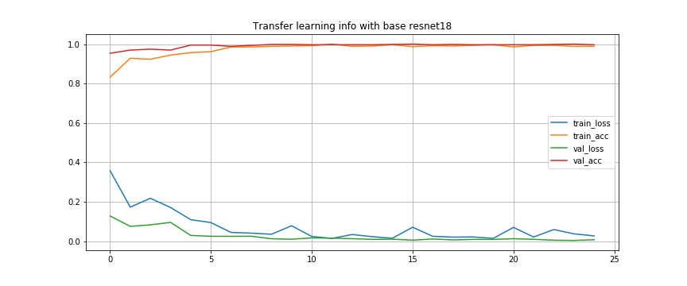
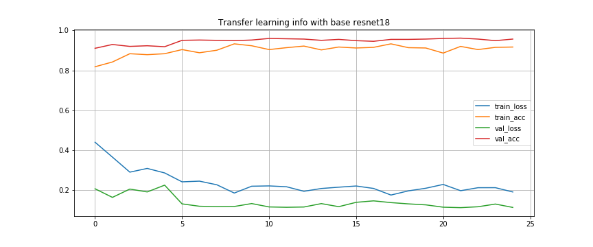

# image_classification
Image classification based on transfer learning using resnet and pytorch.

## Introduction
This project is to predict type 0 layout room images. The [original pytorch transfer learning tutorial](https://pytorch.org/tutorials/beginner/transfer_learning_tutorial.html#sphx-glr-download-beginner-transfer-learning-tutorial-py) is modified for this purpose.

As in the original post, two training methods are used. One is to train all the parameters of the whole network (left), the other is only to train the parameter of the last full connection layer (right). The result shows that training all the parameters of the whole network (left) is better.

## Results with different base network
